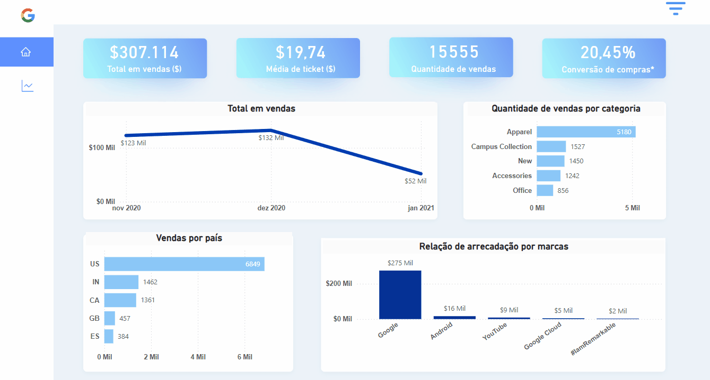

## Google Sales Dashboard
Dashboard desenvolvido para analisar os dados da Google Merchandise Store em 3 meses de dados. Apresento uma visão geral sobre o desempenho de vendas e popularidade de alguns produtos e marcas do Google.

- [Dataset](https://www.kaggle.com/datasets/mexwell/google-merchandise-sales-data/data)

### Dashboard

[Acesse o dashboard](https://app.powerbi.com/view?r=eyJrIjoiYzQyMjM5NTctYzU2MC00MDg3LWJmOGUtYzU4ZGRmNmJiMjc3IiwidCI6IjdlOTNlMjg2LWIyOWEtNDQ1NC1hNDFhLWU4NDE5ZWM5ZGViNSJ9)

