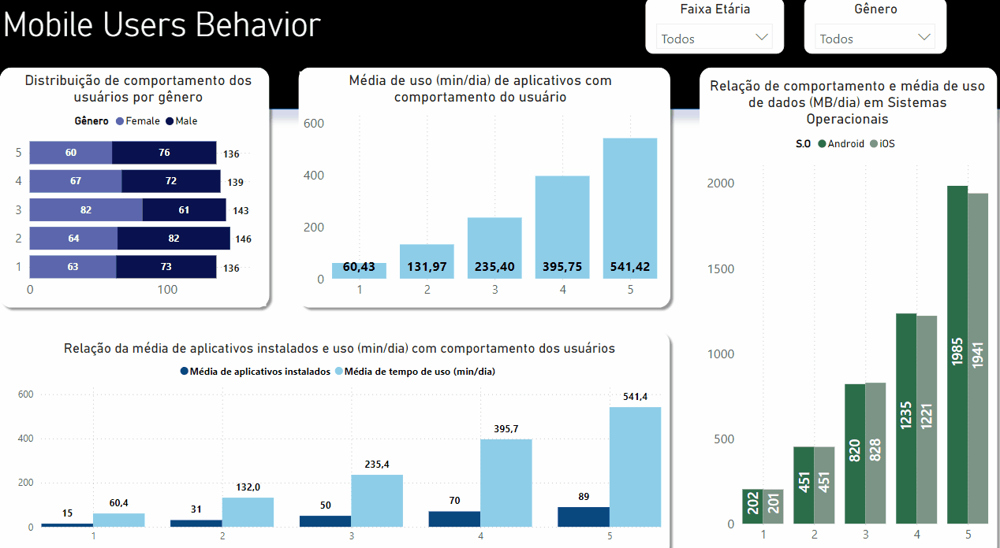

## Mobile Device Usage and User Behavior Dataset 

Dashboard que busca analisar padrões e comportamento de usuários de dispositivos móveis.

[-Dataset utilizado](https://www.kaggle.com/datasets/valakhorasani/mobile-device-usage-and-user-behavior-dataset)

Baseado em categorização do engajamento dos usuários, há a classificação em 5 classes:

1. Classe 1 (Baixo Engajamento)

Usuários que apresentam pouco uso do dispositivo e dos aplicativos.

2. Classe 2 (Uso Moderado-Baixo)

Usuários que fazem uso moderadamente baixo dos dispositivos.

3. Classe 3 (Uso Médio)

Representa um grupo de usuários intermediários em termos de engajamento.

4. Classe 4 (Uso Moderado-Alto)

Usuários com engajamento elevado, que utilizam os dispositivos de maneira consistente.

5. Classe 5 (Alto Engajamento)

Usuários com engajamento muito alto, que apresentam padrões de uso intensivo.

Os fatores analisados incluem tempo de uso de aplicativos, consumo de dados, número de aplicativos instalados, características básicas do usuário e informações sobre a aplicação mobile utilizada.
## Dashboard

[Acesse o dashboard](https://app.powerbi.com/view?r=eyJrIjoiN2MyNzhmY2UtY2IzNC00MDFjLWE2NTUtZDg2NDA1OWQ0ZmQ5IiwidCI6IjdlOTNlMjg2LWIyOWEtNDQ1NC1hNDFhLWU4NDE5ZWM5ZGViNSJ9)

